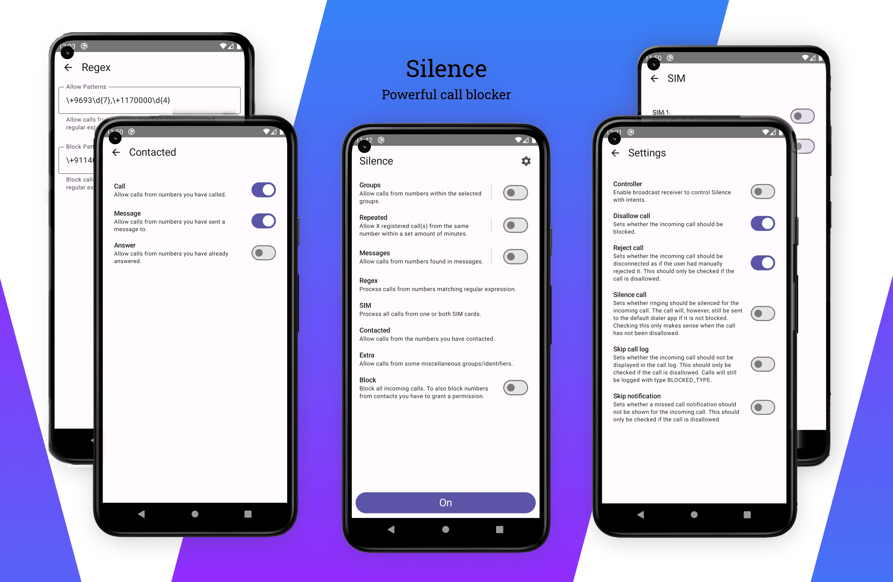
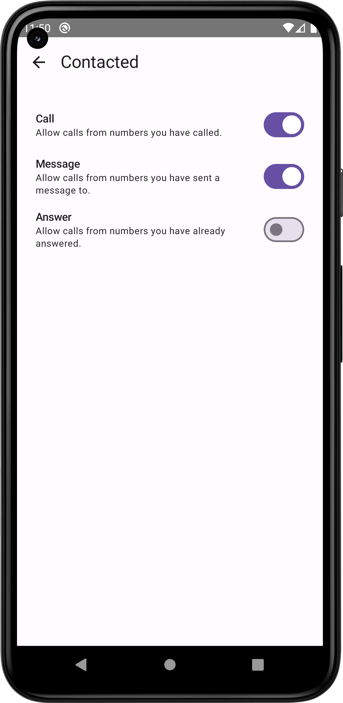
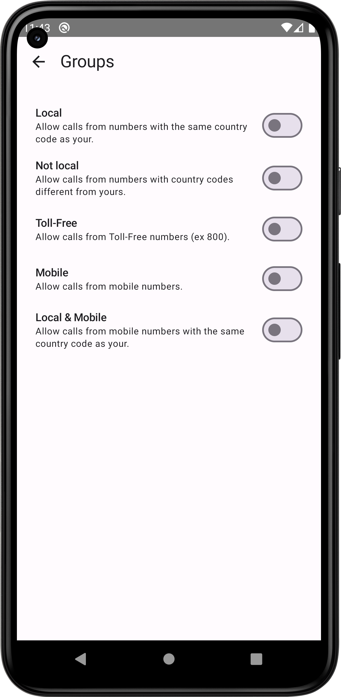
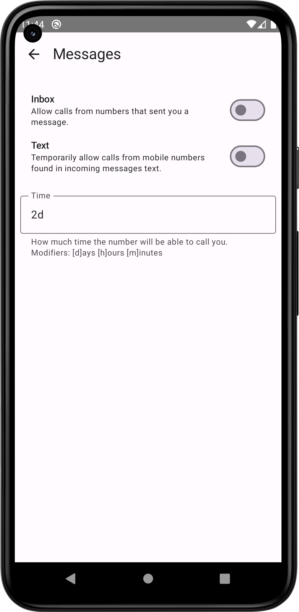
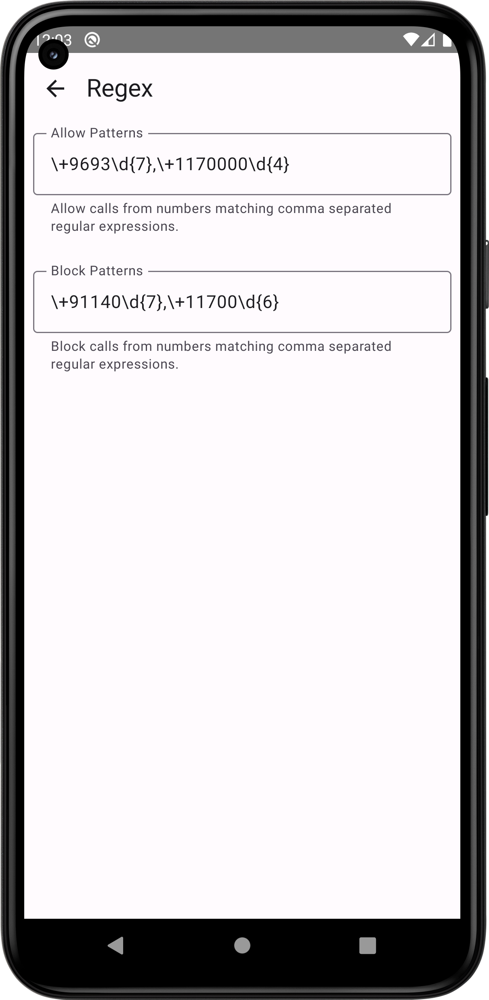
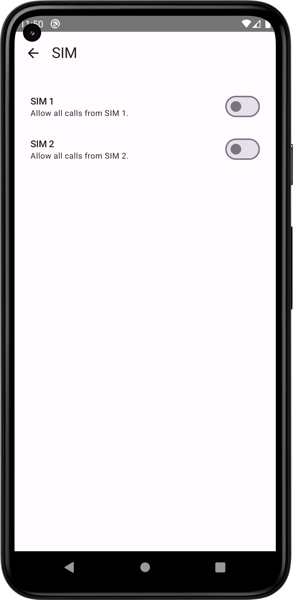

<h1 align="center">Silence</h1>  
<h3 align="center">Block unknown callers</h3>  
 

<b>By default numbers not in your contacts are blocked.</b>

Optionally allow:
* Numbers you have contacted
* Numbers within the selected groups
* X registered call(s) from the same number within a set amount of minutes
* Numbers found in messages
* Numbers matching REGEX patterns
* and more..

Optionally block:
* Numbers matching REGEX patterns, including numbers in contacts

If the app rejects calls from contacts on Android 10, allow _Contacts_ permission manually in 
`App info → Permissions`.

More

 
 
 

     
 
 

## Permissions

* CALL_SCREENING - block or allow call
* READ_CALL_LOG - check you have called/answered the number and count times the number have called you in X minutes
* READ_SMS - check you have sent a message to the number and you received a message from the number
* NOTIFICATION_LISTENER - find mobile numbers in messages
* READ_PHONE_STATE - check on which SIM the number is calling
* RECEIVE_BOOT_COMPLETED - persist clean expired numbers job across reboots
* READ_CONTACTS - check the number exists in contacts on Android 10 or block calls from them

## Localization

## License

